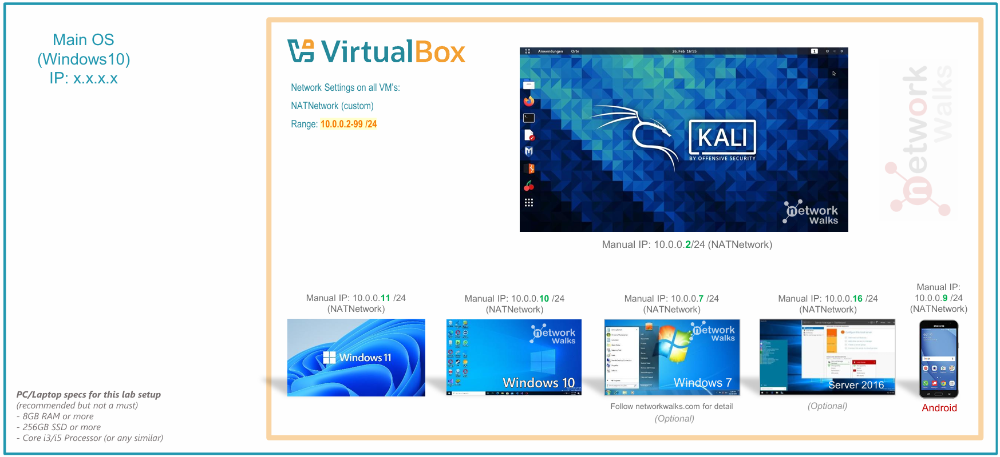
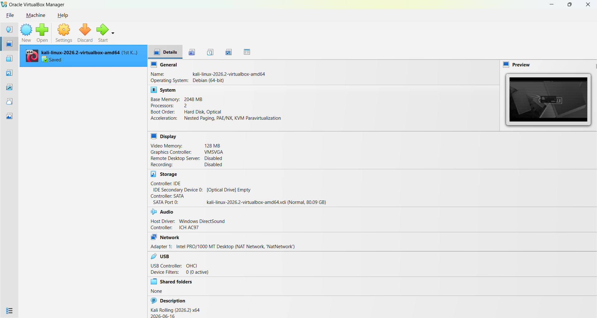
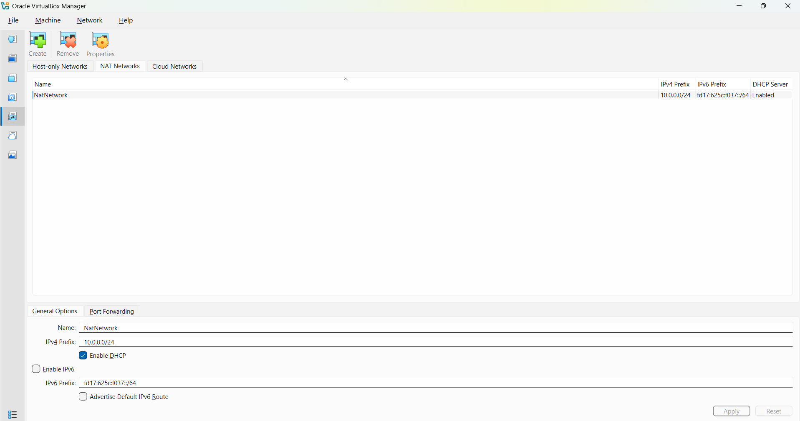
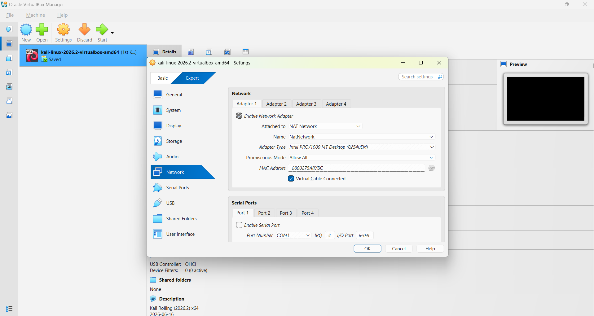
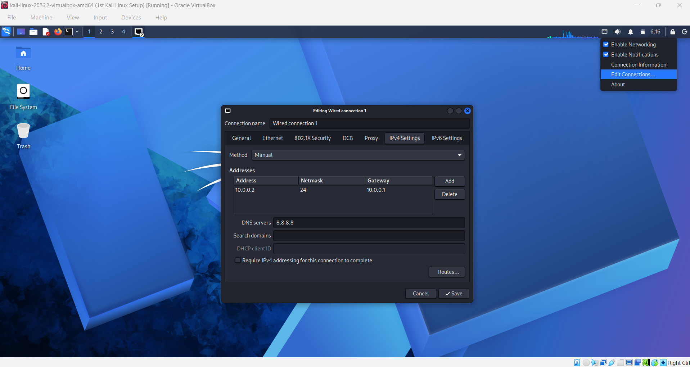
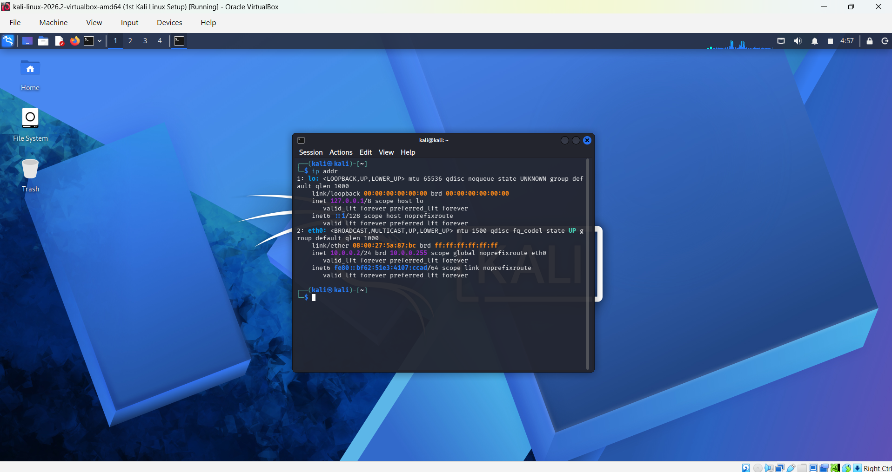
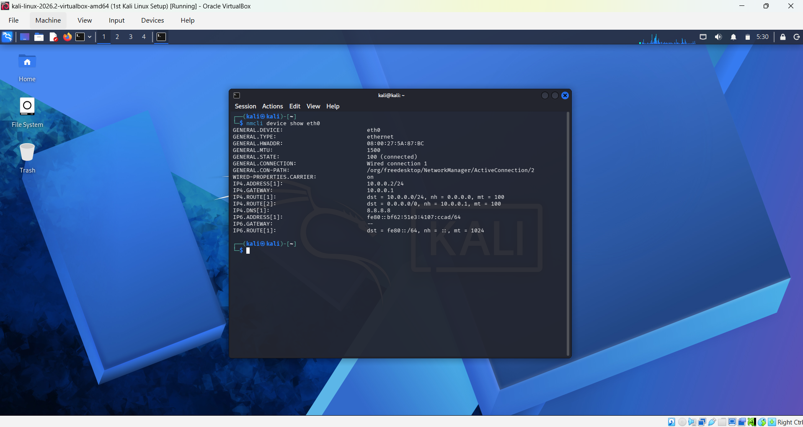
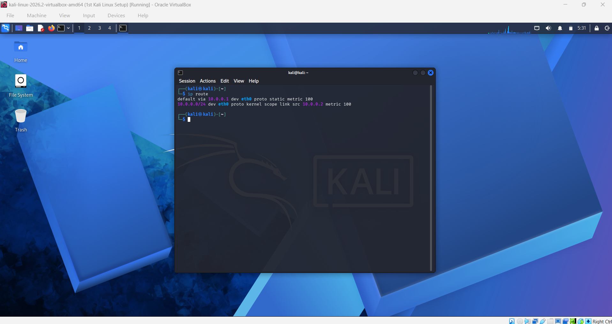
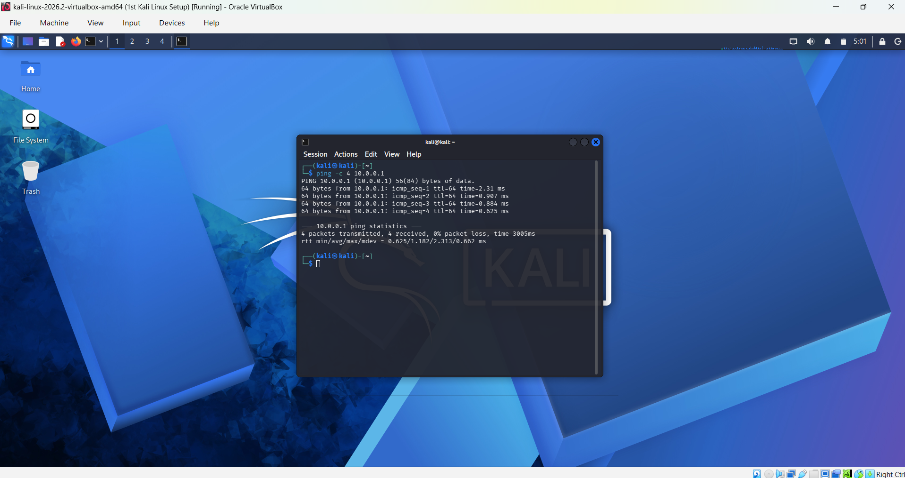

# Week 01 — Phase 1: Cybersecurity Lab Setup

## Overview

This phase focused on setting up the initial virtual cybersecurity lab environment using VirtualBox and Kali Linux.

The lab environment was configured with a dedicated NAT Network so that virtual machines can communicate with each other within the same private network.

## Objectives

- Install the required virtualization and file management tools.
- Set up a NAT Network in VirtualBox.
- Configure Kali Linux as the initial virtual machine.
- Configure the Kali Linux network connection.
- Configure DNS settings.
- Verify the assigned IP address and network connectivity.
- Troubleshoot an initial internet connectivity issue.
- Create a snapshot of the configured Kali Linux environment.

## Tools and Technologies

- VirtualBox
- Kali Linux
- 7-Zip
- VirtualBox NAT Network
- NetworkManager (`nmcli`)
- Linux networking commands

## Lab Architecture



## ⚙️ Lab Configuration

The following configuration was used for the cybersecurity lab environment during Phase 1.

| Component | Configuration |
|---|---|
| 🖥️ Host OS | Windows |
| 🧠 Host RAM | 16 GB |
| ⚡ Processor | AMD Ryzen 7 |
| 🧰 Hypervisor | VirtualBox 7.2.16 |
| 🐉 Security OS | Kali Linux 2026.2 |
| 🧠 Kali RAM | 2048 MB |
| 🌐 Virtual Network | NAT Network |
| 📡 Network Name | `NATNetwork` |
| 🔢 Network Address | `10.0.0.0/24` |
| 🐧 Kali IP Address | `10.0.0.2/24` |
| 🚪 Default Gateway | `10.0.0.1` |
| 🌍 DNS Server | `8.8.8.8` |
| 📡 DHCP | Enabled |

---

# Setup Process

## 1. Installed 7-Zip

7-Zip was installed as one of the required utilities for handling compressed files and virtual machine resources.

---

## 2. Installed VirtualBox

Oracle VirtualBox was installed to provide the virtualization environment required for the cybersecurity lab.



---

## 3. Created the NAT Network

A NAT Network named `NATNetwork` was created in VirtualBox using the `10.0.0.0/24` network.

DHCP was kept **enabled** as required for the lab setup.

The NAT Network provides a private network through which the virtual machines in the lab can communicate with each other.



---

## 4. Configured the Kali Linux Network Adapter

Kali Linux was imported into VirtualBox and its network adapter was configured to use the `NATNetwork`.

The first network adapter was attached to the NAT Network created in the previous step.



The VM was allocated:

```text
RAM: 2048 MB
```

---

## 5. Configure the Kali Linux Network

The Kali Linux network configuration was checked and configured with a consistent IPv4 address.

```text
IP Address: 10.0.0.2
Subnet Mask: 255.255.255.0
Gateway: 10.0.0.1
DNS: 8.8.8.8
```



---

## 6. Verified the Kali Linux IP Address

The following command was used in Kali Linux to check the available network interfaces and assigned IP addresses:

```bash
ip addr
```

The `eth0` interface was assigned the following IPv4 address:

```text
10.0.0.2/24
```

This confirms that Kali Linux successfully received an address within the `10.0.0.0/24` network.



---

## 7.  Verifying Configured DNS

The IPv4 DNS configuration was set to:

```text
8.8.8.8
```

This DNS server can be used to resolve domain names into IP addresses.



---

## 8. Verified the Routing Configuration

The routing configuration was checked using:

```bash
ip route
```

This was used to verify the network route and identify the gateway used by the Kali Linux system.




---

## 9. Tested Gateway Connectivity

Connectivity to the NAT Network gateway was tested using:

```bash
ping -c 4 10.0.0.1
```

The ping test successfully received responses from the gateway at `10.0.0.1`.



---

# Troubleshooting

## Internet Connectivity Issue

During the initial network setup, Kali Linux experienced an issue connecting to the internet.

To resolve the issue, the NetworkManager connection was modified using the following commands:

```bash
sudo nmcli connection modify "Wired connection 1" ipv4.dad-timeout 0
sudo nmcli connection down "Wired connection 1"
sudo nmcli connection up "Wired connection 1"
```

After applying the configuration and reconnecting the network connection, internet connectivity was restored.

### What This Demonstrated

This issue provided practical experience with:

- NetworkManager and the `nmcli` command-line utility.
- Modifying network connection settings in Linux.
- Bringing a network connection down and back up.
- Troubleshooting network connectivity issues using the Linux command line.

---

# Verification

The Phase 1 environment was verified by:

- Checking the Kali Linux network interface using `ip addr`.
- Confirming the Kali Linux IPv4 address as `10.0.0.2/24`.
- Checking the routing configuration using `ip route`.
- Configuring DNS as `8.8.8.8`.
- Testing connectivity to the NAT Network gateway using `ping`.
- Confirming successful communication with the gateway at `10.0.0.1`.
- Restoring internet connectivity after troubleshooting the initial network issue.

---

# Outcome

The initial cybersecurity lab environment was successfully configured.

Kali Linux is connected to the `NATNetwork` with the IP address `10.0.0.2/24` and is ready for the additional virtual machines that will be configured in the next phase.

---

# What I Learned

Through this phase, I gained practical experience with:

- Setting up a virtual cybersecurity lab using VirtualBox.
- Creating and configuring a NAT Network.
- Connecting a virtual machine to a NAT Network.
- Understanding IPv4 network addressing and subnet notation.
- Checking network interfaces and IP addresses in Linux.
- Understanding the difference between an IP address, gateway, and DNS server.
- Using basic Linux networking commands such as `ip addr`, `ip route`, and `ping`.
- Using NetworkManager and `nmcli` to modify network settings.
- Troubleshooting a Linux network connectivity issue.
