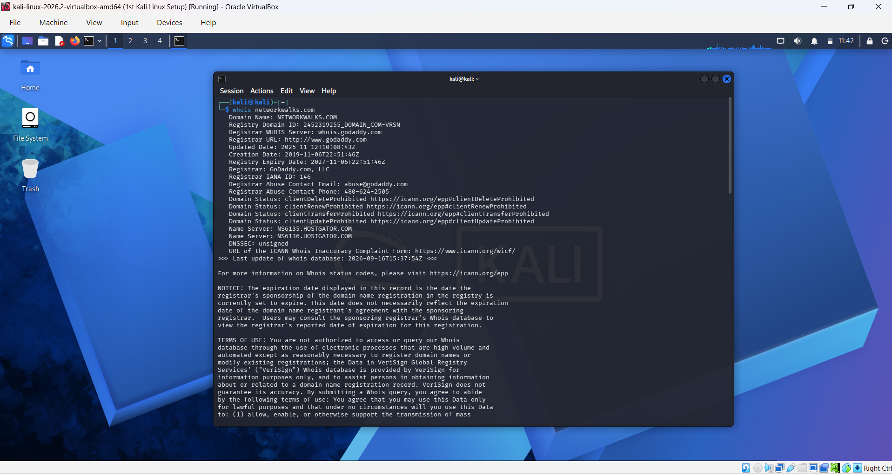
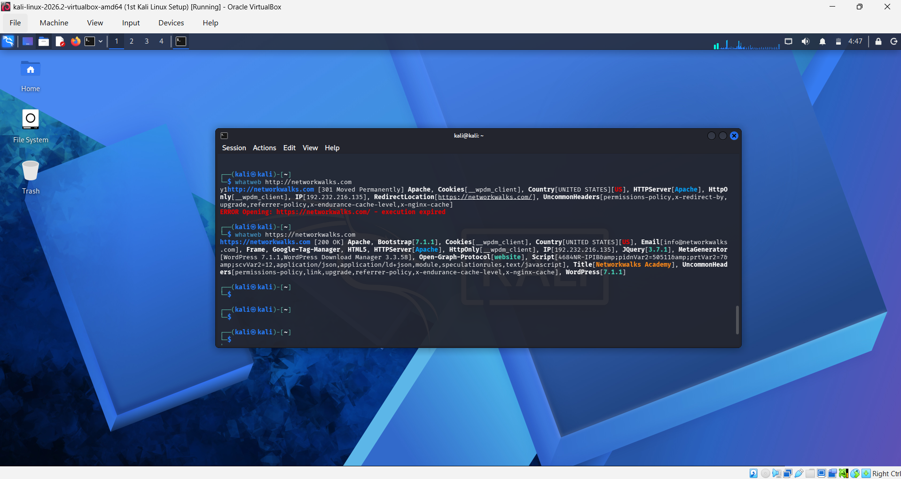
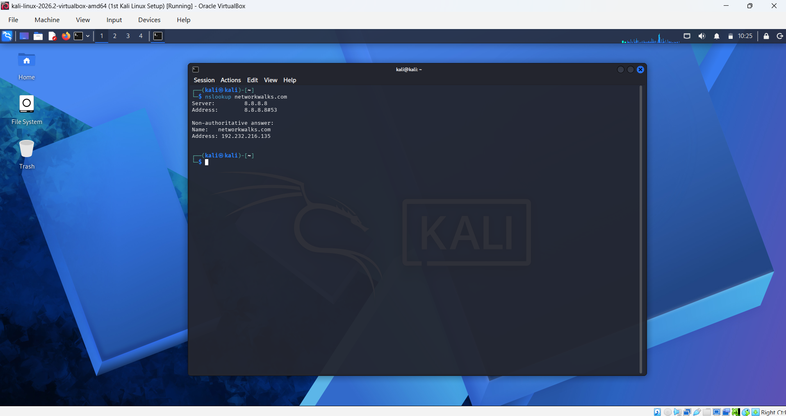
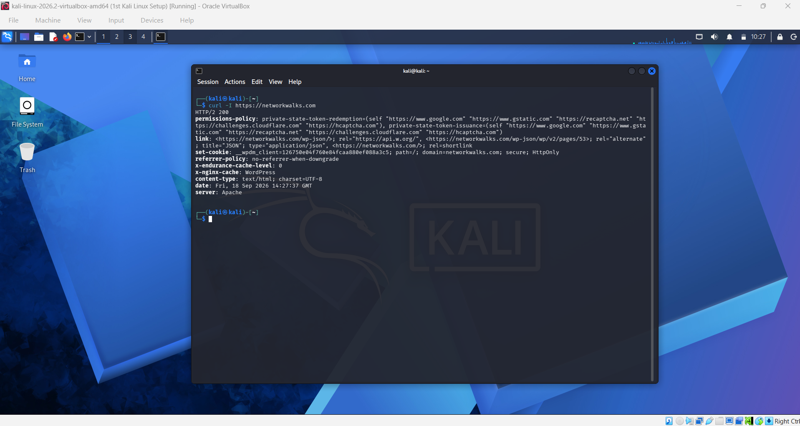
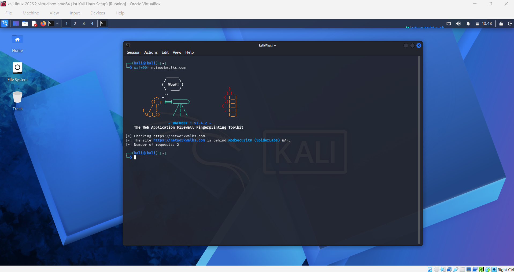
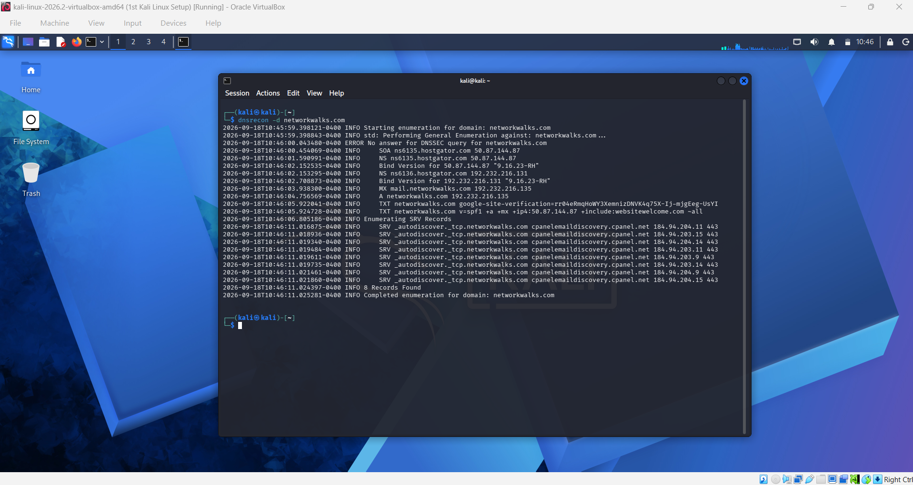
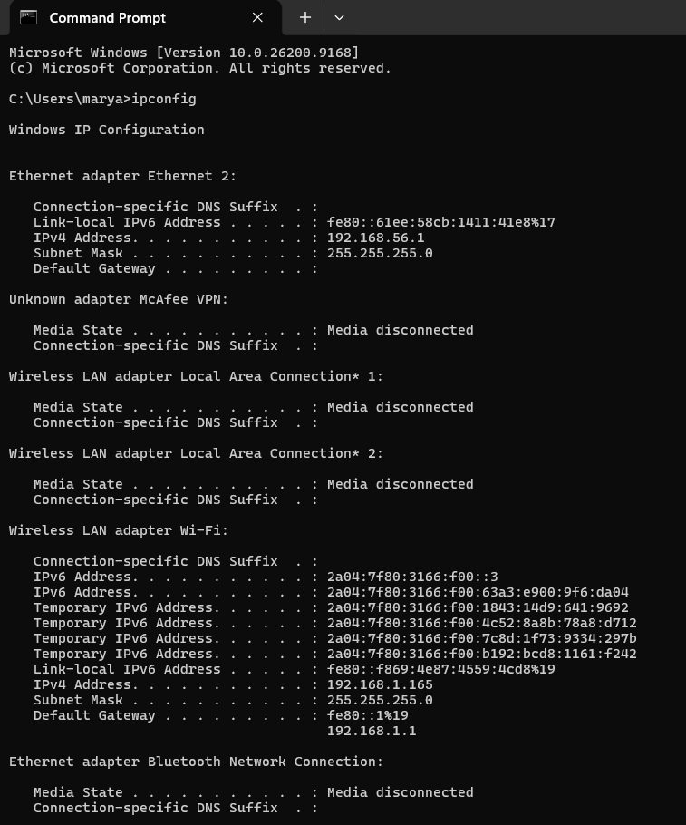
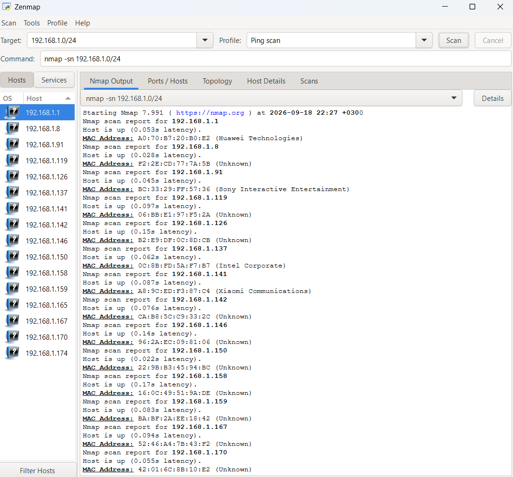
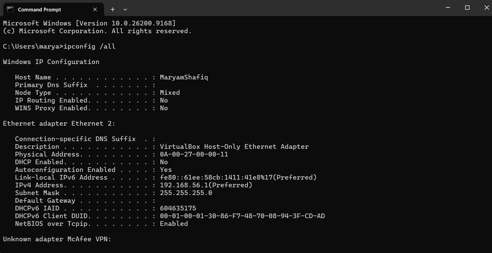
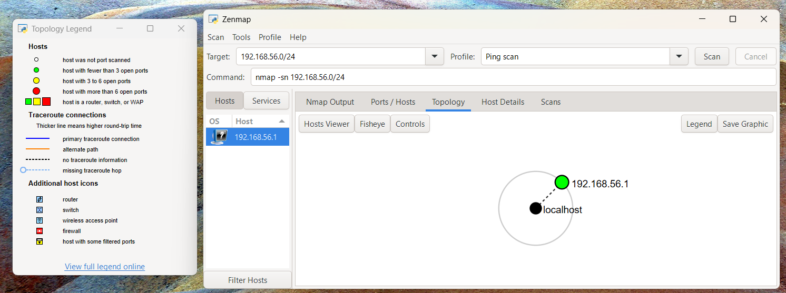

# Week 02 — Footprinting & Network Scanning

## Overview

During Week 02 of my Cybersecurity Internship at Networkwalks, I completed practical activities covering two main areas:

1. Footprinting and reconnaissance using multiple Kali Linux tools.
2. Network discovery and scanning using Zenmap on my local LAN.

The footprinting activity focused on gathering publicly available information about the assigned domain, `networkwalks.com`, using different reconnaissance tools.

The network scanning activity focused on identifying my local IP address and LAN subnet, discovering live hosts on my local network, identifying their IP and MAC addresses, and generating a network topology using Zenmap.

All activities were performed within the scope of the assigned cybersecurity internship exercises.

---

## Table of Contents

1. [Disclaimer](#1-disclaimer)
2. [Introduction](#2-introduction)
3. [Objectives](#3-objectives)
4. [Tools Used](#4-tools-used)
5. [Footprinting & Reconnaissance](#5-footprinting--reconnaissance)
6. [Task 1 — WHOIS](#6-task-1--whois)
7. [Task 2 — WhatWeb](#7-task-2--whatweb)
8. [Task 3 — NSLookup](#8-task-3--nslookup)
9. [Task 4 — cURL HTTP Response Headers](#9-task-4--curl-http-response-headers)
10. [Task 5 — WAFW00F](#10-task-5--wafw00f)
11. [Task 6 — DNSRecon](#11-task-6--dnsrecon)
12. [Footprinting Summary](#12-footprinting-summary)
13. [Network Scanning with Zenmap](#13-network-scanning-with-zenmap)
14. [Task 1 — Install Zenmap](#14-task-1--install-zenmap)
15. [Task 2 — Find Local IP Address and LAN Subnet](#15-task-2--find-local-ip-address-and-lan-subnet)
16. [Task 3 — Find Live Hosts](#16-task-3--find-live-hosts)
17. [Task 4 — Number of Live Hosts](#17-task-4--number-of-live-hosts)
18. [Task 5 — IP Address of the Live Hosts](#18-task-5--ip-address-of-the-live-hosts)
19. [Task 6 — MAC Addresses of the Live Hosts](#19-task-6--mac-addresses-of-the-live-hosts)
20. [Task 7 — Zenmap Network Topology](#20-task-7--zenmap-network-topology)
21. [Network Scanning Summary](#21-network-scanning-summary)
22. [Findings and Security Observations](#22-findings-and-security-observations)
23. [Recommendations](#23-recommendations)
24. [What I Learned](#24-what-i-learned)
25. [Evidence](#25-evidence)
26. [Conclusion](#26-conclusion)

---

# 1. Disclaimer

The reconnaissance and network scanning activities documented in this repository were performed as part of an authorized cybersecurity internship and practical learning exercise.

The tools and techniques demonstrated here should only be used against systems, networks, and devices where appropriate authorization has been provided or where the systems are owned by the person performing the testing.

The purpose of this work is educational and focused on understanding cybersecurity reconnaissance and network discovery techniques.

---

# 2. Introduction

This report documents the practical work completed during Week 02 of my Networkwalks Cybersecurity Internship.

The week covered two practical modules:

- Footprinting with multiple Kali Linux tools.
- Network scanning and discovery using Zenmap.

For the footprinting activity, I used six Kali Linux tools to gather different types of publicly available information about `networkwalks.com`.

For the network scanning activity, I used Windows Command Prompt and Zenmap to identify my local network configuration, discover live hosts, identify IP and MAC address information, and generate a network topology.

The activities helped me understand the reconnaissance and network discovery stages of cybersecurity and how different tools can provide different types of information about a target.

---

# 3. Objectives

The main objectives of this week's activities were to:

- Understand the concept of footprinting and reconnaissance.
- Gather publicly available information about a domain.
- Use multiple Kali Linux reconnaissance tools.
- Identify domain registration information using WHOIS.
- Fingerprint web technologies using WhatWeb.
- Resolve a domain name to its IP address using NSLookup.
- Inspect HTTP response headers using cURL.
- Detect a Web Application Firewall using WAFW00F.
- Enumerate DNS records using DNSRecon.
- Install and use Zenmap for network discovery.
- Identify the local IP address and LAN subnet.
- Discover live hosts within the local subnet.
- Determine the number of live hosts discovered.
- Identify the IP addresses of discovered hosts.
- Identify MAC addresses where available.
- Generate and save a network topology in PDF format.

---

# 4. Tools Used

| Tool / Technology | Purpose |
|---|---|
| Kali Linux | Operating system used for footprinting and reconnaissance |
| WHOIS | Obtaining publicly available domain registration information |
| WhatWeb | Fingerprinting web technologies |
| NSLookup | Resolving domain names to IP addresses |
| cURL | Inspecting HTTP response headers |
| WAFW00F | Detecting Web Application Firewalls |
| DNSRecon | Enumerating DNS records |
| Windows Command Prompt | Identifying local IP and network configuration |
| Zenmap | Graphical interface for Nmap network discovery |
| Nmap | Network scanning engine used by Zenmap |
| PDF | Format used to save the Zenmap topology |

---

# 5. Footprinting & Reconnaissance

## 5.1 Target

The domain used for the assigned footprinting exercises was:

`networkwalks.com`

The following six Kali Linux tools were used:

- WHOIS
- WhatWeb
- NSLookup
- cURL
- WAFW00F
- DNSRecon

Each tool was used to collect a different type of information about the target.

---

# 6. Task 1 — WHOIS

## Objective

Use WHOIS to find publicly available domain registration details.

## Tool Used

`WHOIS`

## Command Used

```bash
whois networkwalks.com
```

## Description

WHOIS was used to retrieve publicly available registration information associated with the `networkwalks.com` domain.

The output was reviewed for information such as domain registration details, registrar information, domain dates, and name servers where available.

## Evidence



## Observation

The WHOIS lookup provided publicly available information associated with the target domain.

This demonstrated how domain registration information can be used as part of the initial reconnaissance process.

---

# 7. Task 2 — WhatWeb

## Objective

Use WhatWeb to fingerprint the web technologies used by the target website.

## Tool Used

`WhatWeb`

## Commands Used

```bash
whatweb http://networkwalks.com
whatweb https://networkwalks.com
```

## Description

WhatWeb was used to identify technologies and components exposed by the target website.

The HTTP version redirected to HTTPS, while the HTTPS scan successfully returned technology fingerprinting information.

## Key Observations

The successful HTTPS scan identified information including:

- Apache
- WordPress
- Bootstrap
- jQuery
- HTML5
- Open Graph
- WP Download Manager
- Website title: Networkwalks Academy
- IP address reported by WhatWeb: `192.232.216.135`

## Evidence



## Observation

Web technology fingerprinting can provide useful information about the technologies exposed by a website.

This information can help a security professional understand the technology stack during an authorized reconnaissance exercise.

---

# 8. Task 3 — NSLookup

## Objective

Use NSLookup to resolve the domain to its IP address.

## Tool Used

`NSLookup`

## Command Used

```bash
nslookup networkwalks.com
```

## Description

NSLookup was used to query DNS information for the target domain and determine the IP address associated with the domain.

## Result

The IP address identified during the exercise was:

`192.232.216.135`

## Evidence



## Observation

DNS resolution provides a connection between a human-readable domain name and the IP address associated with the service.

---

# 9. Task 4 — cURL HTTP Response Headers

## Objective

Use cURL with the `-I` option to inspect the HTTP response headers.

## Tool Used

`cURL`

## Command Used

```bash
curl -I https://networkwalks.com
```

## Description

The `-I` option was used with cURL to request the HTTP response headers without retrieving the complete webpage body.

The response was reviewed for information such as HTTP status, server information, cookies, redirects, and other response headers.

## Evidence



## Observation

HTTP response headers can expose technical information about how a web server and application are configured.

---

# 10. Task 5 — WAFW00F

## Objective

Use WAFW00F to detect whether a Web Application Firewall is protecting the target website.

## Tool Used

`WAFW00F`

## Command Used

```bash
wafw00f networkwalks.com
```

## Result



## Observation

WAFW00F was used to identify whether a Web Application Firewall could be detected protecting the target website.

The result is a tool-based identification and does not by itself indicate that the target is vulnerable.

---

# 11. Task 6 — DNSRecon

## Objective

Use DNSRecon to enumerate DNS records associated with the target domain.

## Tool Used

`DNSRecon`

## Command Used

```bash
dnsrecon -d networkwalks.com
```

## Description

DNSRecon was used to enumerate DNS-related information associated with the domain.

The output was reviewed for records and information such as:

- A records
- NS records
- MX records
- TXT records
- SOA information
- Other DNS information returned by the tool

## Key Observations

The DNSRecon results provided information related to the DNS infrastructure of the target domain.

## Evidence



## Observation

DNS records can provide information about the infrastructure associated with a domain, including web services, mail services, name servers, and other services.

---

# 12. Footprinting Summary

The six reconnaissance tools provided different categories of information about the target domain.

| Tool | Information Collected |
|---|---|
| WHOIS | Domain registration information |
| WhatWeb | Web technologies and application fingerprint |
| NSLookup | Domain-to-IP resolution |
| cURL | HTTP response headers |
| WAFW00F | Web Application Firewall detection |
| DNSRecon | DNS infrastructure and records |

Using multiple tools provided different perspectives during the footprinting process.

---

# 13. Network Scanning with Zenmap

## 13.1 Objective

The second part of Week 02 focused on network discovery using Zenmap.

The assigned tasks required me to:

- Download and install Zenmap.
- Identify my local IP address.
- Identify my LAN subnet.
- Discover live hosts within the subnet.
- Determine the number of live hosts.
- Identify the IP addresses of live hosts.
- Identify MAC addresses where available.
- Generate and save a network topology in PDF format.

The scanning activity was performed against my own local network.

---

# 14. Task 1 — Install Zenmap

## Objective

Download and install Zenmap from the official source on the Windows PC.

## Description

Zenmap was successfully installed on the Windows PC and used as the graphical interface for the assigned network discovery activity.

## Tool

`Zenmap / Nmap`

---

# 15. Task 2 — Find Local IP Address and LAN Subnet

## Objective

Identify the local IPv4 address and LAN subnet of the Windows PC.

## Command Used

Windows Command Prompt was used with:

```cmd
ipconfig
```

The active network adapter was reviewed to identify the IPv4 address, subnet mask, and default gateway.

## Local Network Information

| Information | Result |
|---|---|
| Local IPv4 Address | `192.168.1.165` |
| Subnet Mask | `255.255.255.0` |
| Default Gateway | `192.168.1.1` |
| LAN Subnet | `192.168.1.0/24` |

## Evidence



---

# 16. Task 3 — Find Live Hosts

## Objective

Find the list of live hosts/PCs within the local IP subnet.

## Zenmap Configuration

The LAN subnet identified using `ipconfig` was entered into the Zenmap **Target** field.

The **Ping scan** profile was selected to perform host discovery.

The target was the local LAN subnet rather than the Kali Linux VirtualBox network.

## Target

`192.168.1.0/24`

## Command Generated by Zenmap

```bash
nmap -sn 192.168.1.0/24
```

The `-sn` option tells Nmap to perform host discovery only (a ping scan) without scanning any ports.

## Evidence



## Observation

The Ping Scan identified the hosts that responded to the discovery probes on the local subnet. Each responding host was listed in the Zenmap **Hosts** panel, and the Nmap output reported "Host is up" along with the measured latency and, where available, the MAC address.

---

# 17. Task 4 — Number of Live Hosts

## Result

The Zenmap scan identified:

**16 live hosts**

## Description

Sixteen hosts responded to the discovery scan within the scanned `192.168.1.0/24` subnet.

This result represents the hosts that responded to the specific discovery probes used by the scan. It does not necessarily mean that no other devices exist on the network, since some devices may not respond to network discovery or ping probes.

## Evidence

The live-host results are visible in the Zenmap **Hosts** panel and scan output:


---

# 18. Task 5 — IP Address of the Live Hosts

## Result

The IP addresses identified for the live hosts were:

| # | IP Address |
|---|---|
| 1 | `192.168.1.1` |
| 2 | `192.168.1.8` |
| 3 | `192.168.1.91` |
| 4 | `192.168.1.119` |
| 5 | `192.168.1.126` |
| 6 | `192.168.1.137` |
| 7 | `192.168.1.141` |
| 8 | `192.168.1.142` |
| 9 | `192.168.1.146` |
| 10 | `192.168.1.150` |
| 11 | `192.168.1.158` |
| 12 | `192.168.1.159` |
| 13 | `192.168.1.165` |
| 14 | `192.168.1.167` |
| 15 | `192.168.1.170` |
| 16 | `192.168.1.174` |

## Evidence

The live host IP information is shown in the Zenmap results:


---

# 19. Task 6 — MAC Addresses of the Live Hosts

## Result

The MAC addresses identified during the scan, together with the vendor reported by Nmap, were:

| IP Address | MAC Address | Vendor (per Nmap) |
|---|---|---|
| `192.168.1.1` | `A0:70:B7:20:B0:E2` | Huawei Technologies |
| `192.168.1.8` | `F2:2E:CD:77:7A:5B` | Unknown |
| `192.168.1.91` | `BC:33:29:FF:57:36` | Sony Interactive Entertainment |
| `192.168.1.119` | `06:BB:E1:97:F5:2A` | Unknown |
| `192.168.1.126` | `B2:E9:DF:0C:8D:CB` | Unknown |
| `192.168.1.137` | `0C:8B:FD:5A:F7:B7` | Intel Corporate |
| `192.168.1.141` | `A8:9C:ED:F3:87:C4` | Xiaomi Communications |
| `192.168.1.142` | `CA:B8:5C:C9:33:2C` | Unknown |
| `192.168.1.146` | `96:2A:EC:09:81:06` | Unknown |
| `192.168.1.150` | `22:9B:B3:45:94:BC` | Unknown |
| `192.168.1.158` | `16:0C:49:51:9A:DE` | Unknown |
| `192.168.1.159` | `BA:BF:2A:EE:18:42` | Unknown |
| `192.168.1.165` | `<ADD MAC ADDRESS FROM YOUR FULL SCAN OUTPUT>` | — |
| `192.168.1.167` | `52:46:A4:7B:43:F2` | Unknown |
| `192.168.1.170` | `42:01:6C:8B:10:E2` | Unknown |
| `192.168.1.174` | `<ADD MAC ADDRESS FROM YOUR FULL SCAN OUTPUT>` | — |

## Description

Nmap identified the vendor for four of the visible MAC addresses (Huawei, Sony Interactive Entertainment, Intel, and Xiaomi). The remaining addresses were reported as "Unknown". Many of these begin with a byte such as `F2`, `06`, `B2`, `CA`, `96`, `22`, `16`, `BA`, `52`, or `42`, which indicates a locally administered address. This is commonly seen with modern phones and other devices that use randomized (private) MAC addresses, so no vendor can be matched.

## Evidence



---

# 20. Task 7 — Zenmap Network Topology

## Objective

Display and save the network topology in PDF format.

## Description

After completing the network discovery scan, the **Topology** section in Zenmap was opened to visualize the discovered network information.

The topology output was saved in PDF format as required by the practical task.

## Evidence



## Saved Output

The generated PDF topology is included in this repository:

[`topology/zenmap-topology.pdf`](topology/zenmap-topology.pdf)

---

# 21. Network Scanning Summary

| Task | Result |
|---|---|
| Zenmap Installation | Completed |
| Local IP Identification | Completed |
| LAN Subnet Identification | Completed (`192.168.1.0/24`) |
| Ping Scan | Completed (`nmap -sn 192.168.1.0/24`) |
| Live Hosts Found | 16 |
| Live Host IPs | `192.168.1.1`, `.8`, `.91`, `.119`, `.126`, `.137`, `.141`, `.142`, `.146`, `.150`, `.158`, `.159`, `.165`, `.167`, `.170`, `.174` |
| MAC Addresses | Identified for the hosts listed in Task 6 |
| Network Topology | Generated and saved as PDF |

---

# 22. Findings and Security Observations

The activities performed during this week were primarily reconnaissance and network discovery exercises.

The following observations were made:

| # | Observation | Evidence | Security Relevance |
|---|---|---|---|
| 1 | Web technologies were identifiable | WhatWeb | Technology information can contribute to application fingerprinting. |
| 2 | Domain-to-IP information was available | NSLookup | Provides information about the infrastructure associated with the domain. |
| 3 | HTTP response headers were accessible | cURL | Headers may expose technical information about the web service. |
| 4 | WAF detection was performed | WAFW00F | Provides information about web application security infrastructure. |
| 5 | DNS information was publicly queryable | DNSRecon | DNS records can provide information about domain infrastructure and services. |
| 6 | 16 live hosts were discovered on the local network | Zenmap | Network discovery helps identify active devices within an authorized network and supports asset inventory. |
| 7 | Several devices used randomized (locally administered) MAC addresses | Zenmap | Randomized MACs hide vendor information, which makes identifying and inventorying devices harder. |

These observations represent information gathered during reconnaissance and network discovery. They should not be interpreted as confirmed vulnerabilities.

No exploitation or unauthorized access was performed as part of these activities.

---

# 23. Recommendations

Based on the observations and learning objectives from these exercises, the following general security practices are relevant:

### 1. Review publicly exposed technology information

Organizations should periodically review what information about their web technologies, CMS platforms, plugins, and applications is publicly observable.

### 2. Keep web technologies updated

Web servers, CMS platforms, plugins, libraries, and other components should be kept updated and reviewed against relevant security advisories.

### 3. Review HTTP response headers

HTTP response headers should be reviewed to determine whether unnecessary technical information is being exposed.

### 4. Review DNS records

DNS records should be periodically reviewed to ensure that only required services and information are publicly exposed.

### 5. Monitor network devices

Organizations should maintain awareness of devices connected to their internal networks and investigate unexpected devices. On this LAN, 16 hosts responded to the ping scan, so each one should be identifiable and expected.

### 6. Maintain network documentation

Network topology and device information should be documented and kept up to date.

### 7. Perform reconnaissance within an authorized scope

Footprinting and network scanning should only be performed against systems and networks where appropriate authorization has been provided.

---

# 24. What I Learned

Through this week's practical activities, I gained hands-on experience with the reconnaissance and network discovery stages of cybersecurity.

## Footprinting

I learned how to use:

- WHOIS for domain registration information.
- WhatWeb for web technology fingerprinting.
- NSLookup for DNS resolution.
- cURL for inspecting HTTP response headers.
- WAFW00F for identifying Web Application Firewall technology.
- DNSRecon for DNS enumeration.

## Network Scanning

I also learned how to:

- Identify my local IPv4 configuration using `ipconfig`.
- Determine my LAN subnet.
- Configure a Ping Scan in Zenmap (`nmap -sn`).
- Discover responding hosts on a local network.
- Determine the number of live hosts discovered by the scan (16).
- Identify IP addresses of discovered hosts.
- Identify MAC addresses and vendors where available.
- Recognize that randomized MAC addresses show up as "Unknown" vendors.
- Generate a network topology using Zenmap.
- Save the topology output in PDF format.

Most importantly, I learned that reconnaissance provides useful information before deeper security testing begins. Different tools provide different perspectives, and combining their results can provide a broader understanding of a target environment.

I also learned the importance of performing reconnaissance and network scanning only within an authorized scope.

---

# 25. Evidence

The following screenshots document the practical work completed during Week 02.

## Footprinting

### 1. WHOIS


### 2. WhatWeb


### 3. NSLookup


### 4. cURL


### 5. WAFW00F


### 6. DNSRecon


---

## Network Scanning

### 7. Local IP Address and LAN Subnet


### 8. Zenmap Ping Scan


### 9. MAC Addresses


### 10. Zenmap Network Topology


The generated topology PDF is available in:

[`topology/zenmap-topology.pdf`](topology/zenmap-topology.pdf)

---

# 26. Conclusion

During Week 02 of my Cybersecurity Internship at Networkwalks, I completed practical activities covering footprinting, reconnaissance, and network scanning.

For the footprinting activity, I used six Kali Linux tools to collect different types of publicly observable information about the assigned domain. This included domain registration information, web technologies, DNS resolution, HTTP response headers, WAF detection, and DNS records.

For the network scanning activity, I used Windows Command Prompt and Zenmap to identify my local network configuration, discover 16 active hosts on the `192.168.1.0/24` subnet, identify IP and MAC address information, and generate a network topology.

The exercises helped me understand how reconnaissance and network discovery can be used to build an initial picture of a system or network before further authorized security testing.

No exploitation or vulnerability validation was performed as part of these activities.

All practical work was completed within the scope of the assigned cybersecurity internship.
