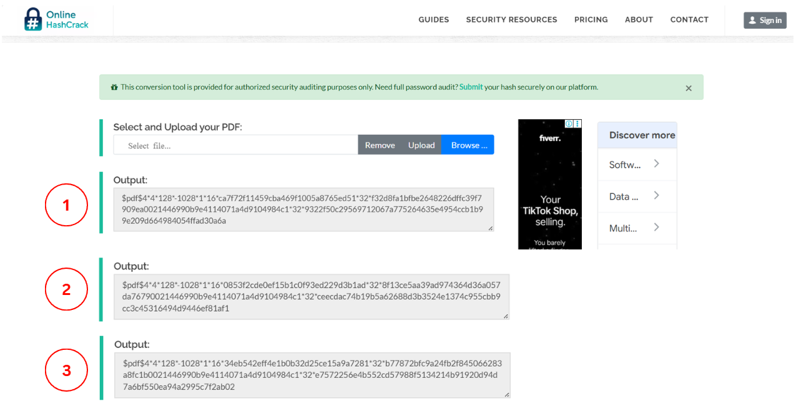
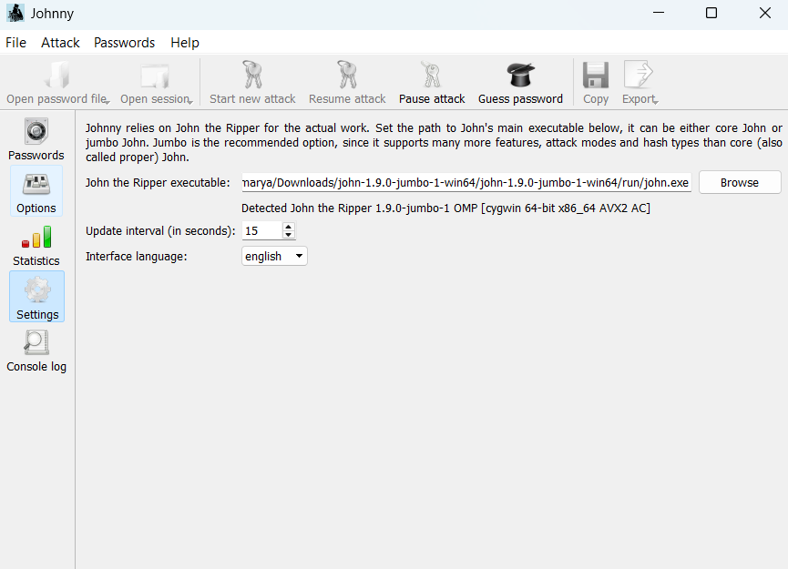
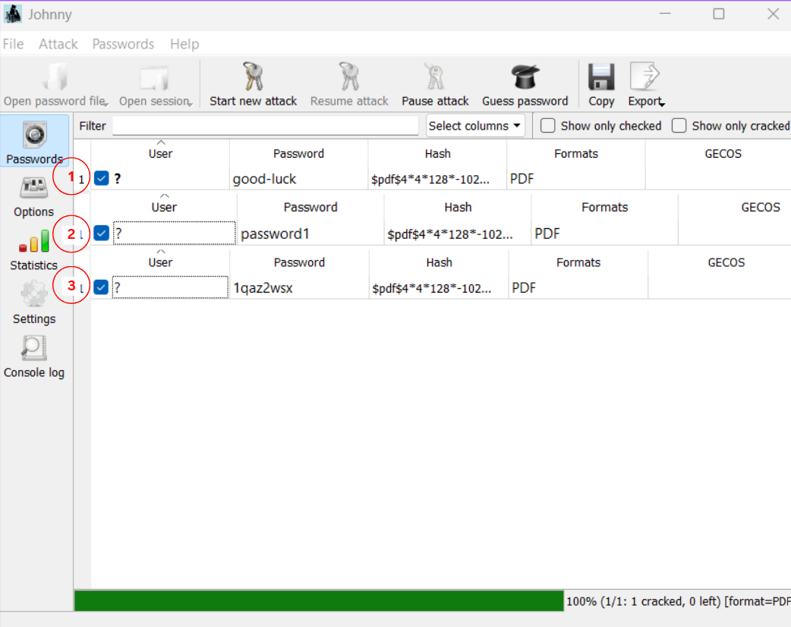
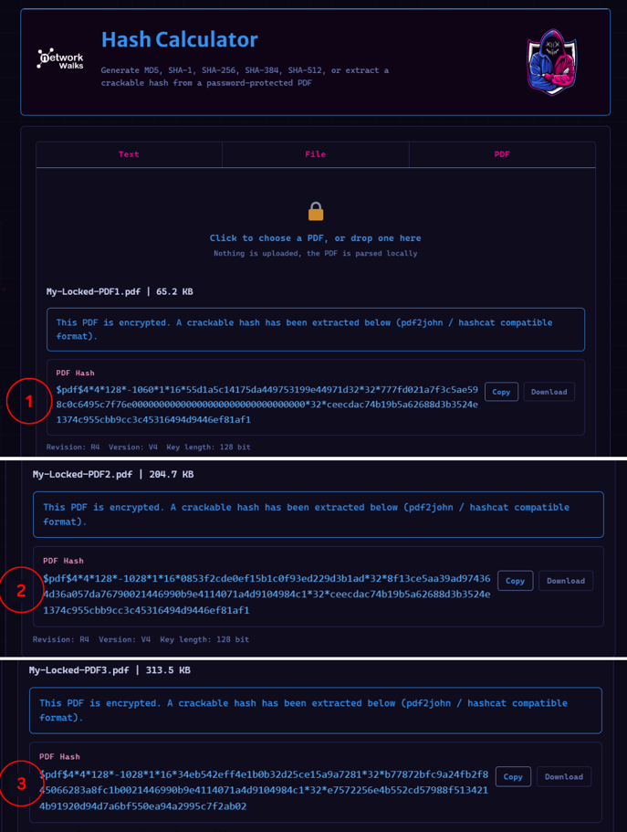
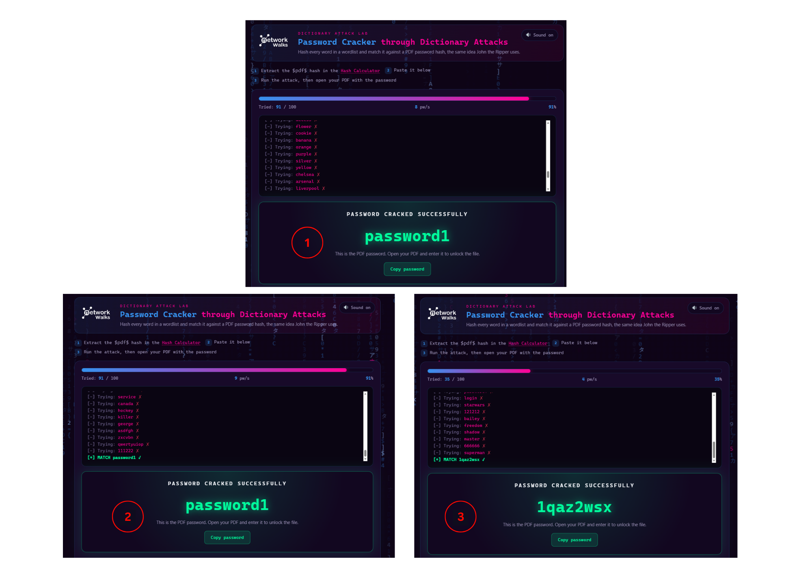

# Week 03 — PDF Password Cracking 🔐

## Overview

During Week 03 of my Cybersecurity Internship at Networkwalks, I completed practical exercises focused on cracking the passwords of authorized, password-protected PDF files.

The week consisted of two modules:

- **Module 1:** Password cracking using John the Ripper (JTR) and Johnny on Windows.
- **Module 2:** Password cracking using the Networkwalks Hash Calculator and Password Cracker.

For both modules, I extracted the PDF password hashes, performed password-cracking attacks, recovered the passwords, successfully unlocked the PDF files, and captured the flags contained in the lab files.

---

## 🛠️ Tools Used

| Tool | Purpose |
|---|---|
| John the Ripper (JTR) | PDF password cracking |
| Johnny | Graphical interface for John the Ripper |
| Networkwalks Hash Calculator | PDF hash extraction |
| Networkwalks Password Cracker | Password cracking |
| Windows | Lab environment |

---

# 🔓 Module 1 — John the Ripper & Johnny

## 1. PDF Hash Extraction

The three password-protected PDF files provided for the lab were processed using a PDF hash extraction tool.

The extracted hashes were in the `$pdf$` format and were saved for use with John the Ripper.

---

## 2. Johnny Configuration

Johnny was installed and configured to use the `john.exe` executable from the John the Ripper installation.

The extracted PDF hashes were then loaded into Johnny to begin the password-cracking process.

---

## 3. Password Cracking & Recovery

A password-cracking attack was performed using John the Ripper through the Johnny interface.

The passwords for all three assigned PDF files were successfully recovered.

### 📋 Module 1 Results

| PDF File | Recovered Password | Captured Flag |
|---|---|---|
| `My Locked PDF1` | `good-luck` | `nw{cybersecurity_flag_captured_2608}` |
| `My Locked PDF2` | `password1` | `nw{networkwalks_persistence_jtr_270521}` |
| `My Locked PDF3` | `1qaz2wsx` | `nw{networkwalks_flag_260821_1}` |

The recovered passwords were successfully used to unlock all three PDF files.

---

# 🌐 Module 2 — Networkwalks Hash Calculator & Password Cracker

## 1. PDF Hash Extraction

The three assigned PDF files were uploaded to the Networkwalks Hash Calculator.

The tool generated the corresponding PDF password hashes beginning with `$pdf$`.

---

## 2. Password Cracking

The extracted hashes were copied into the Networkwalks Password Cracker and the password-cracking attacks were started.

The passwords for all three assigned PDF files were successfully recovered.

### 📋 Module 2 Results

| PDF File | Recovered Password | Captured Flag |
|---|---|---|
| `My-Locked-PDF1` | `password1` | `nw{networkwalks_flag1_jtr_270521_1}` |
| `My-Locked-PDF2` | `password1` | `nw{networkwalks_persistence_jtr_270521}` |
| `My-Locked-PDF3` | `1qaz2wsx` | `nw{networkwalks_flag_260821_1}` |

The recovered passwords were successfully used to unlock all three PDF files.

---

# 📊 Overall Results

Both modules were completed successfully.

| Module | PDFs Tested | Passwords Recovered | PDFs Unlocked | Flags Captured |
|---|---:|---:|---:|---:|
| Module 1 — JTR & Johnny | 3 | 3 | 3 | 3 |
| Module 2 — Networkwalks Tools | 3 | 3 | 3 | 3 |
| **Total** | **6** | **6** | **6** | **6** |

---

# 📚 What I Learned

Through this week's practical exercises, I gained hands-on experience with:

- Extracting password hashes from protected PDF files.
- Understanding the `$pdf$` hash format.
- Configuring John the Ripper and Johnny on Windows.
- Loading PDF hashes into a password-cracking tool.
- Performing password-cracking attacks.
- Recovering passwords from authorized lab files.
- Verifying recovered passwords by unlocking protected PDFs.
- Using the Networkwalks Hash Calculator.
- Using the Networkwalks Password Cracker.
- Understanding the importance of strong passwords and protecting password hashes.

---

# 🧪 Lab Workflow

The overall workflow followed during the exercises was:

    Password-Protected PDF
            ↓
    Extract PDF Hash
            ↓
    Load Hash into Cracking Tool
            ↓
    Start Password-Cracking Attack
            ↓
    Recover Password
            ↓
    Unlock PDF
            ↓
    Capture Flag

---

# ⚠️ Authorization

All password-cracking activities documented in this repository were performed against the PDF files provided as part of the authorized Networkwalks cybersecurity internship exercises.

The techniques demonstrated should only be used against files, systems, or accounts where appropriate authorization has been provided.

---

# ✅ Week 03 Status

- [x] John the Ripper installed and configured
- [x] Johnny configured
- [x] PDF hashes extracted
- [x] Module 1 password cracking completed
- [x] Three passwords recovered using JTR/Johnny
- [x] Three PDFs successfully unlocked
- [x] Three flags captured
- [x] Networkwalks Hash Calculator used
- [x] Module 2 password cracking completed
- [x] Three passwords recovered using Networkwalks tools
- [x] Three PDFs successfully unlocked
- [x] Three flags captured
